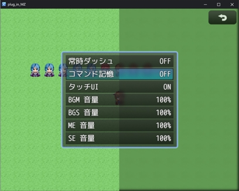

# GMN_BackgroundNotBlur

https://github.com/GEMINIGAMEDEV/RPG-Maker-Plugin/blob/master/MZ/GMN_BackgroundNotBlur.js

メニュー背景をぼかさなくします。

オプション画面等、マップをキャプチャして背景にする画面すべてに適用されます。

---

プラグインに関する問い合わせは [Twitter](https://twitter.com/gemini_gamedev)でお願いいたします。

それ以外の場所は見ていないことが多いので、あらかじめご了承ください。

## 利用方法

特に設定は必要ありません。

## プラグインパラメータ

### opacity
メニュー背景に表示しているマップ画面の不透明度を0から255の間で指定してください。

255で実際のマップと同じになります。デフォルトは192です。