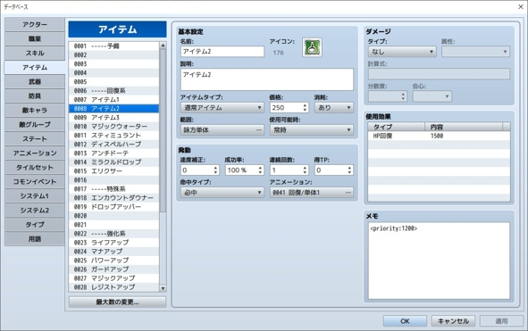
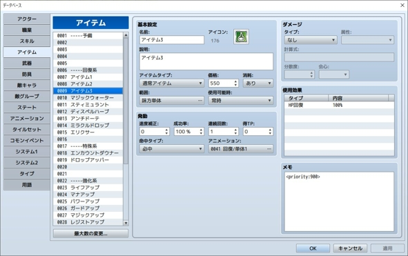
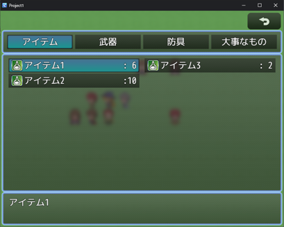

# GMN_DataBasePriority

データベースの項目の表示順を、メモ欄で指定した優先度の順に並び替えられます。

## 利用方法

1. アイテム・スキル・武器・防具 のメモ欄に以下のように優先度を記述します。 
  記述例:
    - アイテム1 `<priority:600>`
    - アイテム2 `<priority:1200>`
    - アイテム3 `<priority:900>`
  と記述すると 
  アイテム1(優先度600)➔アイテム3(優先度900)➔アイテム2(優先度1200) 
  の順に表示されます。 
  ※優先度のタグ名("priority"の箇所)はプラグインパラメータで変更可能です。 
  ※優先度の値("600"の箇所)は正の整数で記述してください。 
  

  
エディタ上の操作と実行結果

  
  
  
  

2. アイテム・スキル・武器・防具が優先度順に表示されるようになります。 
  昇順(1,2,3...の順番)と降順(999999,999998,999997...)を 
  プラグインパラメータで選択可能です。 
  優先度が同じ場合には,、標準仕様通りにID順に並びます。 
3. メモ欄に優先度が設定されていない場合に、 
  プラグインパラメータでデフォルトの優先度を設定できます。 

## プラグインパラメータ

### asc
優先度を昇順と降順のどちらにするかを選択します。
昇順の場合には、1,2,3...の順番で並びます。
降順の場合には、999999,999998,999997...
の順番で並びます。

### defaultPriority
優先度が設定されていない・整数でない場合に設定される
優先度のデフォルト値です。