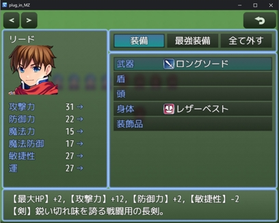

# GMN_DescriptionWithFomula

https://github.com/GEMINIGAMEDEV/RPG-Maker-Plugin/blob/master/MZ/GMN_DescriptionWithFomula.js

装備品の説明文にステータス増減を表示させます。

---

プラグインに関する問い合わせは [Twitter](https://twitter.com/gemini_gamedev)でお願いいたします。

それ以外の場所は見ていないことが多いので、あらかじめご了承ください。

## 利用方法

1. パラメータのフォーマット文字列をプラグインパラメータの「format」で指定します。
 「%1」がパラメータ名に、「%2」がパラメータの値になります。
 例: 攻撃力が30増加する時 => 【攻撃力】+30
 同じ条件で、このパラメータを「%1：%2」とすると「攻撃力：+30」と表示されます。

2. 複数のパラメータを増減させる場合の区切り文字をプラグインパラメータの「separator」で指定します。
 例: 攻撃力が30増加、防御力が30減少する時 => 【攻撃力】+30,【防御力】-30 と「,」で区切って表示されます。

3. プラグインパラメータの「plusSign」でパラメータ増加を表す文字を指定します。
 例: 攻撃力が30増加する時 => 【攻撃力】+30 と数値の先頭に「+」が付きます。

4. プラグインパラメータの「minusSign」でパラメータ減少を表す文字を指定します。
 例: 防御力が30減少する時 => 【防御力】-30 と数値の先頭に「-」が付きます。

5. プラグインパラメータの「paramName」で説明欄に表示する各パラメータの名前を指定します。
 左から、 最大HP, 最大MP, 攻撃力, 防御力, 魔法力, 魔法防御, 敏捷性, 運に相当します。

## プラグインパラメータ

### format

パラメータを表示する際のフォーマット文字列です。

「%1」がパラメータ名に、「%2」がパラメータの値になります。

### separeator
複数のパラメータが増減するときの区切り文字です。

複数のパラメータを増減させる場合に、このパラメータでつなぎます。

### plusSign
パラメーターが増加する場合に、数値の先頭につける記号です。

例: 攻撃力が30増加する時 => 【攻撃力】+30 と数値の先頭に「+」が付きます。

### minusSign
パラメーターが減少する場合に、数値の先頭につける記号です。

例: 防御力が30減少する時 => 【防御力】-30 と数値の先頭に「-」が付きます。

### paramName
説明文に表示するパラメータ名を指定します。

最大HP, 最大MP, 攻撃力, 防御力, 魔法力, 魔法防御, 敏捷性, 運 に

相当する名称を指定できます。