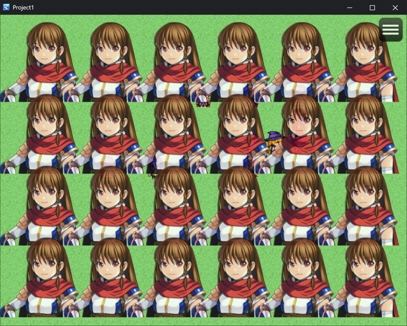
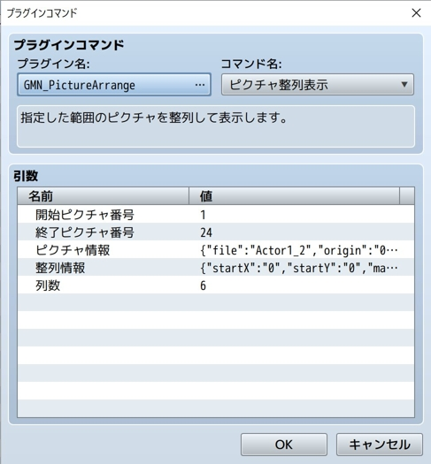
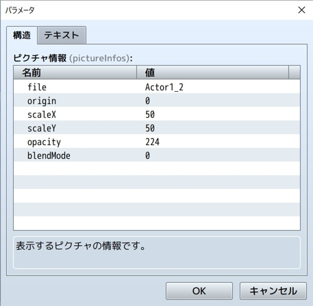
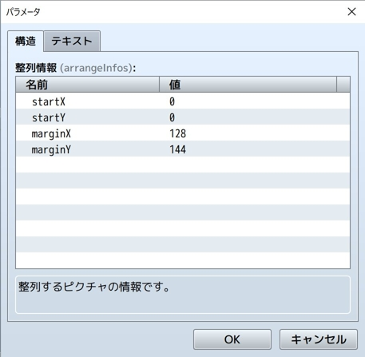

# GMN_PictureArrange

https://github.com/GEMINIGAMEDEV/RPG-Maker-Plugin/blob/master/MZ/GMN_PictureArrange.js

複数のピクチャを整列して表示できます。

---

プラグインに関する問い合わせは [Twitter](https://twitter.com/gemini_gamedev)でお願いいたします。

それ以外の場所は見ていないことが多いので、あらかじめご了承ください。

## 利用方法
プラグインコマンドを利用して複数のピクチャを整列表示できます。
  

  
エディタ上の操作と実行結果

  
  
  
  

  

## プラグインコマンド

### ピクチャ整列表示

#### start
表示を開始するピクチャ番号です。
`start`番から`end`番までのピクチャがプラグインコマンドの対象になります。
#### end
表示を終了するするピクチャ番号です。
`start`番から`end`番までのピクチャがプラグインコマンドの対象になります。
#### pictureInfos
画像ファイル名と座標以外の、複数のピクチャに共通する設定情報です。

イベントコマンド「ピクチャの表示」で設定している内容と同じ。

|パラメータ|説明|
|--|--|
|file|ピクチャ画像|
|origin|原点(0:左上/1:中央)|
|scaleX|X軸方向拡大倍率(%指定)|
|scaleY|Y軸方向拡大倍率(%指定)|
|opacity|不透明度(0-255で指定)|
|blendMode|合成方法(0:通常,1:加算,2:乗算,3:スクリーン)|

#### arrangeInfos

複数ピクチャを並べる際の始点や間隔などの設定情報です。

|パラメータ|説明|
|--|--|
|startX|始点となるピクチャのX座標|
|startY|始点となるピクチャのY座標|
|marginX|ピクチャ同士の間隔(X軸方向)|
|marginY|ピクチャ同士の間隔(Y軸方向)|

#### maxColumns

一行あたり何列のピクチャを含むか表す数値。